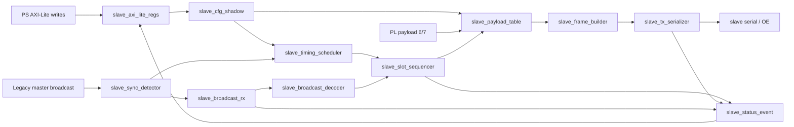

# 차기 Slave AXI IP 설계 방향

## 1. 범위

이 문서는 현재 passive slave RTL을 AXI-Lite로 PS와 연결되는 PL IP로 재설계하기 위한 기준 설계 문서이다. 현재 RTL 사양은 `docs/03_current_slave23_passive_spec_ko.md`에 남기고, 이 문서는 이후 구현할 새 구조의 기준으로 사용한다.

새 slave IP의 목적은 다음 하나로 요약한다.

```text
master의 동기 broadcast frame을 기준으로 시간을 맞춘 뒤,
하나의 PL slave IP가 0~7번 가상 slot 중 활성화된 slot의 차례에
정해진 32-bit payload를 slave response frame으로 송신한다.
```

핵심 데이터 흐름은 아래와 같다.



## 2. 핵심 변경점

| 항목 | 현재 RTL | 차기 IP 기준 |
| --- | --- | --- |
| 제어 | parameter `NODE_ID`, `DIV`, `GUARD_TICKS` | AXI register 기반 runtime 설정 |
| slot 모델 | 한 instance가 한 `NODE_ID`만 담당 | 한 instance가 8개 가상 slot 담당 |
| payload | 단일 `i_PAYLOAD` | slot 0~5 PS register, slot 6~7 PL 내부 payload |
| 활성화 | 항상 해당 `NODE_ID` 응답 | `ACTIVE_SLOT[7:0]` mask로 slot별 송신 |
| bit period | `1 << DIV` | `DIV_REG + 1` |
| guard | slot 뒤에 붙는 대기 시간처럼 사용 | slot 안의 총 무송신 시간, 절반 뒤 송신 |
| 구조 | top FSM 중심 | 기능별 FSM/table 기반 모듈 분리 |

## 3. Timing Source of Truth

모든 문서와 RTL 구현은 아래 정의를 기준으로 한다.

```text
bit_period_ticks = DIV_REG + 1
frame_ticks      = 50 * bit_period_ticks
guard_ticks      = CTRL.GUARD_TICKS
slot_ticks       = frame_ticks + guard_ticks
guard_half_ticks = guard_ticks >> 1

slot_base[n]     = frame_ticks + n * slot_ticks
tx_start[n]      = slot_base[n] + guard_half_ticks
tx_end[n]        = tx_start[n] + frame_ticks
```

`DIV_REG=0`은 정상 입력이며, 실제 bit period는 1 tick이다. `GUARD_TICKS`가 홀수이면 앞쪽 guard는 `GUARD_TICKS >> 1`, 뒤쪽 guard는 `GUARD_TICKS - (GUARD_TICKS >> 1)`로 해석한다.

v1 RTL은 내부 scheduler/sequencer/serializer pipeline 여유를 보장하기 위해 `GUARD_TICKS >= 4`를 요구한다. `ENABLE=1` 상태에서 shadow `GUARD_TICKS`가 0~3이면 sync scheduling과 TX를 막고 `FAULT_SLOT_TIMING_INVALID`를 latch한다.

## 4. Frame Format

master broadcast와 slave response는 기존 master 호환성을 위해 50-bit frame을 유지한다.

```text
frame = 8'hAA preamble + 42-bit Hamming SECDED codeword
```

slave response data field:

```text
hamming_data[34:0] = {slot_id[2:0], payload[31:0]}
```

master broadcast decode field는 기존 호환성을 위해 유지한다.

```text
decoded_broadcast_data[34:27] = halt_mask[7:0]
decoded_broadcast_data[26:17] = broadcast_guard_ticks[9:0]
decoded_broadcast_data[16:0]  = reserved
```

차기 IP에서 timing의 기준은 PS register의 `GUARD_TICKS`이다. broadcast 내부 `guard_ticks` field는 status/debug 또는 master 호환성 확인 용도로만 사용한다.

## 5. Config Snapshot Policy

AXI register 값은 core 내부에서 직접 사용하지 않고 `slave_cfg_shadow`에서 snapshot한 값을 사용한다.

| 상황 | 동작 |
| --- | --- |
| `ENABLE=0` | PS write를 shadow에 즉시 반영 가능 |
| `ENABLE=1`, sync 대기 | core idle clock에서 pending config를 shadow에 commit |
| raw sync edge 감지 | 이미 commit된 shadow 값을 이번 cycle 값으로 freeze |
| RX/TX/schedule 진행 중 | 현재 cycle에는 frozen snapshot 유지, 다음 idle/sync cycle 후보로 pending |
| `ENABLE`이 0으로 내려감 | 신규 sync 및 신규 TX 요청 중지. 진행 중 TX는 frame 완료 후 idle 복귀 권장 |

이 정책은 full-case 테스트에서 재현성을 높이고, frame 중간에 `DIV`, `GUARD_TICKS`, `ACTIVE_SLOT`, payload가 흔들리는 문제를 피한다.

동시성 규칙:

```text
sync edge와 AXI write handshake가 같은 clock에 발생하면,
그 AXI write 값은 현재 sync cycle에 포함하지 않는다.
현재 sync cycle은 sync edge 이전 clock까지 commit된 shadow 값만 사용한다.
```

일정 계산은 raw sync edge 기준으로 시작하되, 구현상 필요한 precompute latency가 있으면 `SYNC_TO_SCHEDULE_LATENCY` 상수로 문서화한다. v1 목표는 0~1 clock latency이며, latency가 생겨도 모든 slot target 비교는 동일한 기준으로 보정해야 한다.

## 5.1 Numeric Width Policy

`DIV_REG`는 32-bit 전체를 raw 입력으로 허용한다. 내부 표현은 overflow를 피하기 위해 다음 폭을 기준으로 한다.

| 값 | 내부 폭 |
| --- | ---: |
| `bit_period_ticks = DIV_REG + 1` | 33 |
| `frame_ticks`, `slot_ticks`, `slot_target_tick[n]`, `sync_tick_counter` | 64 |

serializer와 RX sampler의 reload 값은 `bit_period_ticks - 1`이므로 32-bit `DIV_REG` 자체를 사용할 수 있다. 구현에서 내부 폭을 줄이면 최대 허용 `DIV_REG`와 overflow fault 정책을 register map에 다시 적어야 한다.

## 6. Slot Operation

sync edge가 감지되면 core는 이번 cycle에 사용할 설정을 snapshot한다.

1. `bit_period_ticks`, `frame_ticks`, `slot_ticks`, `guard_half_ticks`를 계산 또는 precompute한다.
2. `ACTIVE_SLOT[7:0]`를 `active_slot_snapshot[7:0]`로 저장한다.
3. slot 0부터 slot 7까지 순서대로 target tick을 기다린다.
4. target tick에서 해당 slot이 active이고 halt되지 않았으며 TX가 idle이면 frame을 송신한다.
5. slot 0~7 scan이 끝나면 `slot_cycle_done`으로 scheduler를 clear하고 다음 sync를 기다린다.

slot 0~5 payload는 `DATA_OUT0`~`DATA_OUT5` snapshot에서 온다. slot 6~7 payload는 PL 내부 입력에서 오며, 현재 RTL은 payload valid가 없으면 해당 slot 송신을 막고 fault를 latch한다.

slot sequencer와 TX path는 ready/valid handshake를 사용한다. payload가 invalid이거나 TX path가 ready가 아니면 sequencer는 TX를 시작하지 않고 skip/fault/event 중 정의된 경로로 관측 가능하게 처리해야 한다.

## 7. Halt Compatibility Policy

legacy 단일 slot RTL은 master broadcast의 `halt_cmd[NODE_ID]`를 즉시 latch하여 다음 TX를 막았다. 차기 다중 slot 구조에서는 즉시 반영하면 slot 0 timing과 decode 완료 timing이 충돌할 수 있다.

권장 정책:

```text
ACTIVE_SLOT은 PS가 정한 기본 송신 mask이다.
broadcast halt_mask는 호환 기능으로 유지하되, 다음 sync cycle에서 snapshot하여 적용한다.
```

즉 현재 sync frame에서 decode된 halt는 현재 cycle의 남은 slot을 흔들지 않고 다음 cycle부터 `active_slot_snapshot & ~halt_mask_snapshot` 형태로 적용한다. 만약 master protocol이 “같은 frame 직후 slot부터 halt 즉시 적용”을 요구한다면, `GUARD_TICKS`의 최소값과 decode latency를 별도로 제약해야 한다.

## 8. 구현 구조 원칙

- top module은 연결만 담당하고 동작 정책을 직접 갖지 않는다.
- AXI protocol, config snapshot, sync 검출, RX decode, timing 계산, slot 순회, payload 선택, frame build, TX serialize, status/event를 분리한다.
- slot 선택과 payload 선택은 8-entry table 또는 명확한 `case` 구조로 구현한다.
- slot target tick은 config snapshot 또는 sync 직후 FF로 precompute하여 긴 조합 경로를 줄인다.
- testbench reference model과 RTL이 같은 구조를 복사하지 않도록, RTL은 FSM/table로 관측 가능하게 만들고 TB는 독립 계산식으로 기대값을 만든다.

## 9. 최종 설계 기준

차기 slave IP는 현재 모듈을 단순 확장하는 방식보다 새 top 구조로 재구성한다. 기존 `reuse/slave_hamming_enc.v`와 `reuse/slave_hamming_dec.v`는 master 호환성이 중요하므로 우선 재사용 후보로 두고, TX/RX는 기능 분리를 위해 새 wrapper 또는 새 모듈로 정리하는 것을 권장한다.
