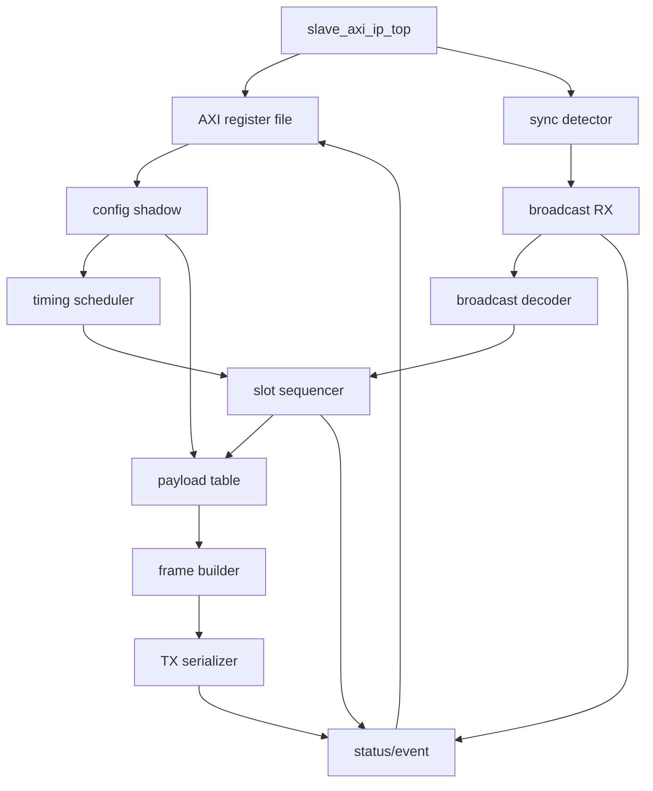

# 차기 Slave IP 모듈 간 인터페이스 정의

## 1. 모듈 트리

```text
slave_axi_ip_top
|-- slave_axi_lite_regs
|-- slave_cfg_shadow
|-- slave_sync_detector
|-- slave_broadcast_rx
|-- slave_broadcast_decoder
|-- slave_timing_scheduler
|-- slave_slot_sequencer
|-- slave_payload_table
|-- slave_frame_builder
|-- slave_tx_serializer
`-- slave_status_event
```

모듈 연결의 큰 방향은 아래 그림을 기준으로 읽는다.



## 2. Top-Level Port 방향

최종 port 이름은 IP packaging 단계에서 Vivado AXI naming에 맞춘다. core 내부 포트는 아래 의미를 유지한다.

| Port | Direction | 설명 |
| --- | --- | --- |
| `i_clk` | input | PL system clock |
| `i_resetn` | input | active-low reset |
| AXI-Lite slave bus | input/output | PS register 접근 |
| `i_master_serial` | input | master broadcast serial input |
| `i_pl_payload6[31:0]` | input | slot 6 PL payload |
| `i_pl_payload6_valid` | input | slot 6 payload valid |
| `i_pl_payload7[31:0]` | input | slot 7 PL payload |
| `i_pl_payload7_valid` | input | slot 7 payload valid |
| `o_slave_serial` | output | slave response serial output |
| `o_slave_oe` | output | optional output enable. push-pull 연결이면 tie-off 가능 |
| `o_irq` | output | optional interrupt |

## 3. 공통 신호 규칙

| 이름 | 의미 |
| --- | --- |
| `cfg_*` | shadow에 반영된 안정 config |
| `reg_*` | AXI register file raw 값 |
| `evt_*` | one-clock event pulse |
| `sts_*` | level status |
| `fault_*` | sticky fault source |
| `*_valid` | payload/data가 유효함 |
| `*_ready` | consumer가 받을 수 있음 |
| `*_req` | 작업 요청 |
| `*_done` | 작업 완료 pulse |

## 4. Module Responsibilities

### 4.1 `slave_axi_lite_regs`

책임: AXI-Lite read/write protocol과 PS-visible register file만 담당한다.

주요 출력:

| Signal | Width | 설명 |
| --- | ---: | --- |
| `reg_enable` | 1 | raw `CTRL.ENABLE` |
| `reg_guard_ticks` | 10 | raw `CTRL.GUARD_TICKS` |
| `reg_active_slot` | 8 | raw `CTRL.ACTIVE_SLOT` |
| `reg_div` | 32 | raw `DIV_REG` |
| `reg_data_out0`~`reg_data_out5` | 32 each | raw PS payload |
| `reg_write_pulse` | 1 | config 관련 register write pulse |
| `event_clear_mask` | 32 | W1C clear mask |
| `fault_clear_mask` | 32 | W1C clear mask |

이 모듈은 `sync`, `slot`, `tx`의 의미를 알지 않는다.

### 4.2 `slave_cfg_shadow`

책임: raw register를 core가 사용할 안정된 config로 변환한다.

입력:

| Signal | 설명 |
| --- | --- |
| `reg_enable`, `reg_guard_ticks`, `reg_active_slot`, `reg_div` | AXI raw register |
| `reg_data_out0`~`reg_data_out5` | PS payload raw register |
| `cfg_freeze_pulse` | 새 sync cycle에서 이미 commit된 shadow를 freeze하는 pulse |
| `core_idle` | core가 완전히 idle |

출력:

| Signal | Width | 설명 |
| --- | ---: | --- |
| `cfg_enable` | 1 | core enable |
| `cfg_guard_ticks` | 10 | active guard setting |
| `cfg_active_slot` | 8 | active slot snapshot |
| `cfg_bit_period_ticks` | 33 | `{1'b0, reg_div} + 33'd1` |
| `cfg_bit_period_reload` | 32 | bit timer reload 값. `cfg_bit_period_ticks - 1`, 즉 `reg_div` |
| `cfg_data_out0`~`cfg_data_out5` | 32 each | payload snapshot |
| `cfg_commit_pulse` | 1 | pending config가 반영됨 |
| `cfg_pending` | 1 | 다음 boundary 반영 대기 |

`cfg_bit_period_ticks`는 항상 1 이상이다.

### 4.3 `slave_sync_detector`

책임: master serial input에서 유효한 sync edge를 검출한다.

입력:

| Signal | 설명 |
| --- | --- |
| `i_master_serial` | 외부 serial input |
| `cfg_enable` | sync detection enable |
| `tx_active` | self TX 중 false detect 방지 |
| `rx_active` | broadcast frame 수신 중 내부 rising edge 재검출 방지 |

출력:

| Signal | 설명 |
| --- | --- |
| `sync_pulse` | idle 상태의 유효한 `0 -> 1` edge one-clock pulse |
| `serial_sync_ff` | optional synchronized serial |

외부 serial input이 PL clock과 비동기이면 이 모듈 안에 2FF synchronizer를 둔다.

### 4.4 `slave_broadcast_rx`

책임: master broadcast frame을 sampling하여 42-bit codeword를 만든다.

입력:

| Signal | 설명 |
| --- | --- |
| `serial_in` | synchronized serial |
| `cfg_enable` | RX enable |
| `cfg_bit_period_reload` | sampling timer reload 값 |
| `sync_pulse` | frame start 기준 |

출력:

| Signal | Width | 설명 |
| --- | ---: | --- |
| `rx_codeword` | 42 | captured codeword |
| `rx_codeword_valid` | 1 | codeword valid pulse |
| `rx_preamble_ok` | 1 | preamble pass pulse |
| `rx_preamble_err` | 1 | preamble fail pulse |
| `rx_active` | 1 | RX busy |

### 4.5 `slave_broadcast_decoder`

책임: Hamming SECDED decode와 broadcast field 추출.

출력:

| Signal | Width | 설명 |
| --- | ---: | --- |
| `broadcast_valid` | 1 | `rx_codeword_valid & ~ham_2bit_err` |
| `broadcast_halt_mask` | 8 | decoded halt mask |
| `broadcast_guard_ticks` | 10 | decoded guard field. timing source는 아님 |
| `broadcast_1bit_err` | 1 | corrected error |
| `broadcast_2bit_err` | 1 | uncorrectable error |

### 4.6 `slave_timing_scheduler`

책임: sync 기준 tick counter와 slot별 target tick table을 관리한다.

입력:

| Signal | 설명 |
| --- | --- |
| `sync_pulse` | schedule start |
| `cycle_done` | slot 0~7 scan 완료 후 schedule clear |
| `cfg_enable` | enable |
| `cfg_bit_period_ticks` | bit period |
| `cfg_guard_ticks` | guard ticks |

출력:

| Signal | Width | 설명 |
| --- | ---: | --- |
| `schedule_active` | 1 | sync 이후 `cycle_done` 전까지 schedule 진행 중 |
| `sync_tick_counter` | 64 | sync 이후 tick |
| `frame_ticks` | 64 | `50 * bit_period_ticks` |
| `slot_ticks` | 64 | `frame_ticks + guard_ticks` |
| `guard_half_ticks` | 64 | `guard_ticks >> 1` |
| `slot_target_tick0`~`slot_target_tick7` | 64 each | slot별 TX start tick |
| `slot_time_match` | 8 | 각 slot target 도달 pulse |

곱셈과 누적 덧셈은 snapshot 시점 또는 sync 직후 여러 FF stage로 나눌 수 있다.

### 4.7 `slave_slot_sequencer`

책임: active slot mask와 timing match를 기준으로 TX 요청을 만든다.

입력:

| Signal | 설명 |
| --- | --- |
| `sync_pulse` | 새 cycle 시작 |
| `cfg_active_slot` | active mask snapshot |
| `halt_mask_snapshot` | optional halt mask |
| `slot_time_match[7:0]` | scheduler match pulse |
| `tx_cmd_ready` | TX path가 새 command를 받을 수 있음 |
| `tx_cmd_accept` | TX command가 수락됨 |
| `tx_cmd_skip` | payload invalid 등으로 command가 skip됨 |
| `tx_done` | serializer done |

출력:

| Signal | Width | 설명 |
| --- | ---: | --- |
| `tx_cmd_valid` | 1 | frame build/TX command valid |
| `tx_cmd_slot_id` | 3 | 송신할 slot id |
| `tx_skip_invalid_payload` | 1 | payload invalid로 slot skip |
| `slot_cycle_done` | 1 | slot 0~7 scan 완료 |
| `sts_current_slot` | 3 | status용 현재 slot |
| `sts_slot_valid` | 1 | 현재 slot 유효 |

권장 FSM:

```text
SEQ_IDLE
SEQ_WAIT_TARGET
SEQ_ISSUE_TX
SEQ_WAIT_TX_DONE
SEQ_NEXT_SLOT
SEQ_DONE
```

slot sequencer는 payload 값을 직접 만들지 않는다. sequencer는 slot id만 발행하고, payload source 선택과 valid 판단은 `slave_payload_table`이 담당한다.

### 4.8 `slave_payload_table`

책임: slot id에 맞는 32-bit payload를 선택한다.

Payload table:

```text
payload_table[0] = cfg_data_out0
payload_table[1] = cfg_data_out1
payload_table[2] = cfg_data_out2
payload_table[3] = cfg_data_out3
payload_table[4] = cfg_data_out4
payload_table[5] = cfg_data_out5
payload_table[6] = i_pl_payload6
payload_table[7] = i_pl_payload7
```

출력:

| Signal | Width | 설명 |
| --- | ---: | --- |
| `selected_payload` | 32 | `tx_slot_id`에 대응하는 payload |
| `selected_payload_valid` | 1 | slot 0~5는 1, slot 6~7은 PL valid 입력 |
| `selected_payload_slot_id` | 3 | payload와 함께 전달되는 slot id |

### 4.9 `slave_frame_builder`

책임: slot id와 payload를 50-bit response frame으로 만든다.

입력:

| Signal | 설명 |
| --- | --- |
| `tx_cmd_valid` | TX command valid |
| `tx_cmd_slot_id[2:0]` | encoded slot id |
| `selected_payload[31:0]` | payload table output |
| `selected_payload_valid` | payload valid |
| `tx_frame_ready` | downstream serializer ready |

출력:

| Signal | Width | 설명 |
| --- | ---: | --- |
| `tx_frame` | 50 | `{8'hAA, hamming_enc({slot_id, payload})}` |
| `tx_frame_valid` | 1 | frame valid |
| `tx_cmd_ready` | 1 | builder가 command 수락 가능 |
| `tx_cmd_accept` | 1 | command 수락 pulse |
| `tx_cmd_skip` | 1 | invalid payload 등으로 command skip |

Hamming encoder는 master 호환성을 위해 기존 `slave_hamming_enc`를 우선 재사용한다. `tx_frame_ready`가 0이면 builder는 command를 수락하지 않는다.

### 4.10 `slave_tx_serializer`

책임: 50-bit frame을 bit period에 맞춰 MSB-first로 송신한다.

입력:

| Signal | 설명 |
| --- | --- |
| `tx_frame[49:0]` | 송신 frame |
| `tx_frame_valid` | frame valid |
| `cfg_bit_period_reload` | bit timer reload 값 |

출력:

| Signal | 설명 |
| --- | --- |
| `slave_serial` | serial output |
| `slave_oe` | TX active 동안 1 |
| `tx_active` | serializer active |
| `tx_done` | one-clock done pulse |
| `tx_frame_ready` | idle 상태에서 1. frame 수락 가능 |

### 4.11 `slave_status_event`

책임: status, event, fault를 AXI register block에 제공한다.

입력:

| Signal | 설명 |
| --- | --- |
| `evt_sync_detected`, `evt_tx_done`, `evt_slot_cycle_done` | event pulse |
| `rx_preamble_err`, `broadcast_1bit_err`, `broadcast_2bit_err` | RX/decode event |
| `fault_tx_overlap` | TX path ready 대기 중 overlap fault |
| `fault_slot_timing_invalid` | `GUARD_TICKS < 4` 등 timing fault |
| `fault_pl_payload6_invalid`, `fault_pl_payload7_invalid` | slot 6/7 payload invalid fault |
| `fault_rx_ham_2bit` | broadcast Hamming 2-bit fault |
| `event_clear_mask`, `fault_clear_mask` | W1C clear |

출력:

| Signal | 설명 |
| --- | --- |
| `status_reg_value` | `STATUS` read data |
| `event_reg_value` | `EVENT` read data |
| `fault_reg_value` | `FAULT` read data |
| `irq` | optional interrupt |

## 5. 병렬 개발 가능 단위

| 개발 단위 | 선행 의존성 |
| --- | --- |
| AXI register block | register map |
| Hamming encoder/decoder compatibility | master frame vector |
| TX serializer | 50-bit frame와 bit period 정의 |
| frame builder | Hamming encoder |
| timing scheduler | timing formula |
| slot sequencer | scheduler match와 active mask 정의 |
| payload table | slot 6/7 PL interface 결정 |
| status/event | event bit allocation |

위 단위는 명확한 mock 신호로 서로 독립 검증 가능해야 한다.
